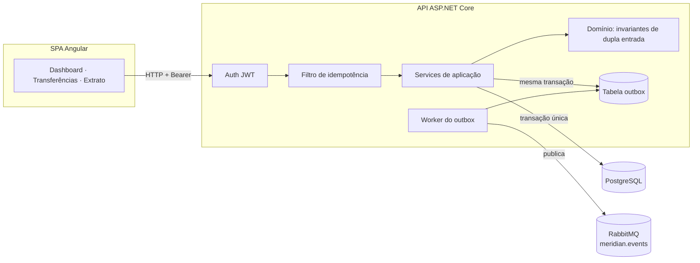

# Meridian — Ledger de Pagamentos Event-Driven

Plataforma de pagamentos construída sobre um **ledger de dupla entrada**, demonstrando
os padrões que fintechs e bancos usam em produção: APIs idempotentes, transactional
outbox, concorrência otimista e mensageria orientada a eventos.

**Stack:** C# / .NET 8 · ASP.NET Core · EF Core · PostgreSQL · RabbitMQ · Angular 21 (signals, zoneless) · Angular Material · Docker · GitHub Actions

## Por que este projeto

Movimentar dinheiro é o problema difícil clássico do backend: operações precisam ser
atômicas, auditáveis, seguras para retry e corretas sob concorrência. O Meridian
implementa as respostas canônicas para cada um desses problemas, de ponta a ponta:

| Problema | Solução implementada |
|---|---|
| Dinheiro não pode aparecer nem sumir | **Ledger de dupla entrada** — toda transferência grava um débito e um crédito atomicamente; saldos são projeções de entries imutáveis |
| Clientes fazem retry de requests | **Idempotency keys** — replays devolvem a resposta original; mesma key com payload diferente é rejeitada (422) |
| Eventos não podem se perder se o broker cair | **Transactional outbox** — eventos são commitados junto com os dados de negócio e repassados ao RabbitMQ por um worker em background, com retry |
| Transferências concorrentes na mesma conta | **Concorrência otimista** — atualização de saldo versionada, com retry automático em conflito |
| Falhas precisam ser depuráveis | **Problem Details (RFC 7807)** em todo caminho de erro, health checks, logs estruturados |

## Arquitetura



O backend segue Clean Architecture: `Domain` (entidades + invariantes, zero
dependências) → `Application` (casos de uso, ports) → `Infrastructure` (EF Core,
RabbitMQ, worker do outbox) → `Api` (controllers, auth, filtros).

## Rodando localmente

### Tudo com Docker

```bash
docker compose up --build
# Web UI:      http://localhost:4200
# API/Swagger: http://localhost:5080/swagger
# RabbitMQ UI: http://localhost:15672 (meridian/meridian)
```

### Modo dev

```bash
# só a infraestrutura
docker compose up postgres rabbitmq -d

# API (http://localhost:5080)
cd server && dotnet run --project src/Meridian.Api

# Web (http://localhost:4200, proxy de /api para a API)
cd web && npm ci && npm start
```

Registre um usuário na UI — você recebe uma conta `Main` em BRL com saldo de abertura
de R$ 1.000,00 (que é uma transferência real de dupla entrada a partir de uma conta de
sistema, então o ledger fecha desde a primeira linha).

### Testes

```bash
cd server && dotnet test          # 43 testes, sem infraestrutura
cd web && npm test -- --no-watch  # Vitest, headless
```

Os testes de backend cobrem os invariantes do ledger (atomicidade débito+crédito,
saldo insuficiente, moedas diferentes), o replay idempotente pelo pipeline HTTP real,
o fluxo de saldo de abertura e os retries de concorrência — rodando contra SQLite
in-memory, sem nenhuma infraestrutura.

## Visão geral da API

| Método | Rota | Observações |
|---|---|---|
| POST | `/api/auth/register` · `/api/auth/login` | JWT |
| GET/POST | `/api/accounts` | apenas contas do usuário |
| GET | `/api/accounts/{id}/entries` | extrato paginado do ledger |
| POST | `/api/accounts/{id}/deposit` | exige `Idempotency-Key` |
| POST | `/api/transfers` | exige `Idempotency-Key` |
| GET | `/api/transfers?accountId=` | paginado |

## Roadmap

- [ ] Entrega de webhooks com assinatura HMAC (consumindo `meridian.events`)
- [ ] Transferências multi-moeda com snapshot da taxa de câmbio
- [ ] Read model / serviço de relatórios como consumer independente do RabbitMQ
- [ ] Load test com k6 provando a idempotência sob retries concorrentes

## Licença

MIT
